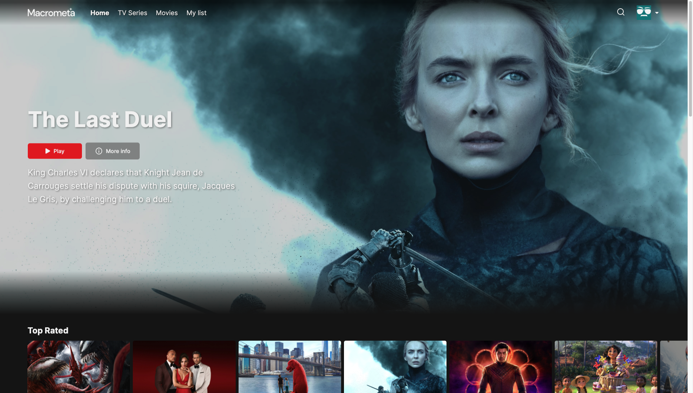

<h1 align="center">Macrometa Edgely + OTT App with Fastly</h1>

### **Live Demo:** https://macrometacorp.github.io/demo-ott-app-fastly/

## Setup

| **Federation**                                        | **Email**                 | **Passsword** |
| ----------------------------------------------------- | ------------------------- | ------------- |
| [Global Data Network](https://gdn.paas.macrometa.io/) | demo-ott-app@macrometa.io | `xxxxxxxx`    |

## Overview

**Architecture:**


**Dashboard:**



### Edgely + Backend setup
**[API setup with Fastly Compute@Edge](api-service/README.md)**

### Macrometa GDN setup

1. Create the following collections in your federation:

```
assets (global)
genres (global)
credits (global)
my_list (global)
users (global)
asset_credit_edge (graph-edge, global)
genres_asset_edge (graph-edge, local)
```

2. Create the following search views in your federation:

**`asset_credit_view`** with Primary sort field `popularity`
| **Mapping - Collection** | **Field** | **Analyzer** |
| ------------------------ | --------- | ------------- |
| assets | title | text_en |
| assets | original_title | text_en |
| assets | overview | text_en |
| credits | name | text_en |

**`asset_type_view`**
| **Mapping - Collection** | **Field** | **Analyzer** |
| ------------------------ | --------- | ------------- |
| genres_asset_edge | asset_type | identity |

3. Create the following graph in your federation:

**`OTT`**
| **Edge Definitions** | **From Collections** | **To Collections** |
| ------------------------ | --------- | ------------- |
| genres_asset_edge | genres | assets |
| asset_credit_edge | assets | credits |

4. Create the following Query workers in your federation:

```
getMovieAssetsByGenre
getTopRatedMovies
getTopRatedTvSeries
getTvSeriesAssetsByGenre
searchByAsset
searchByCredits
```

Refer to this link to add content for each Query worker:

**[Query Workers](query-worker/query-worker.md)**

4. On the development machine, run the following commands in a console:

```
1. git clone https://github.com/Macrometacorp/metaflix-fastly.git
2. cd metaflix-fastly/react-app
3. git fetch
4. npm install
5. npm run start
```

#### Fastly References
https://developer.fastly.com/learning/compute/
https://developer.fastly.com/learning/compute/javascript/
